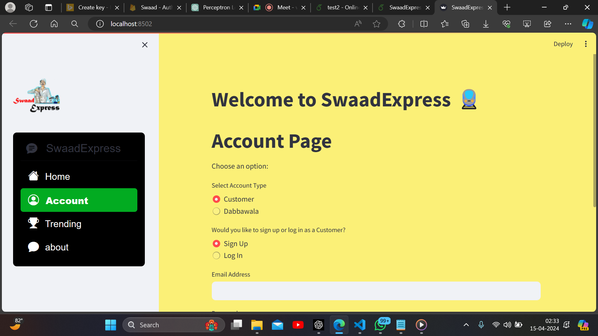
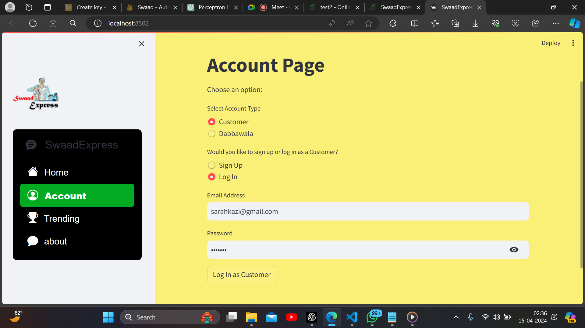
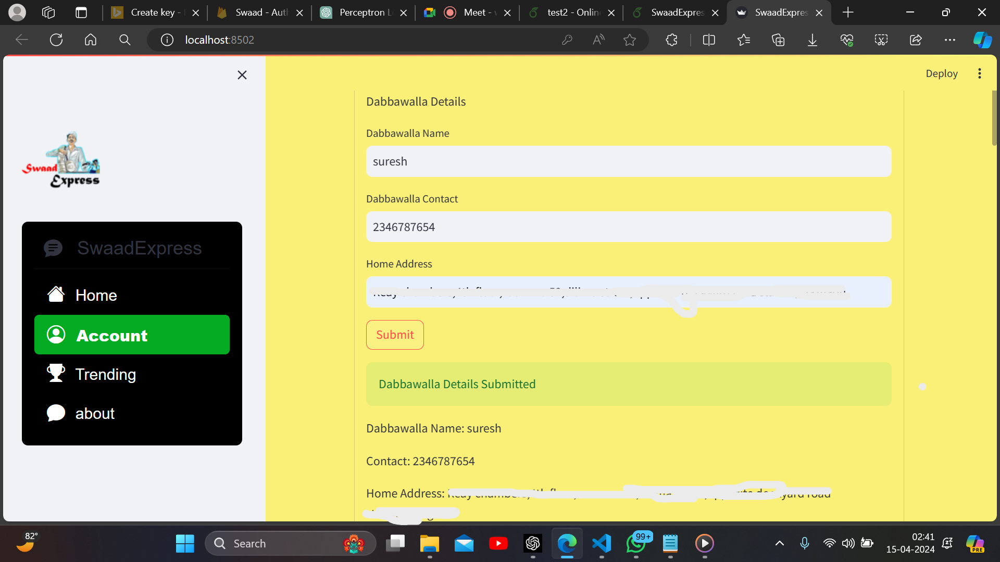
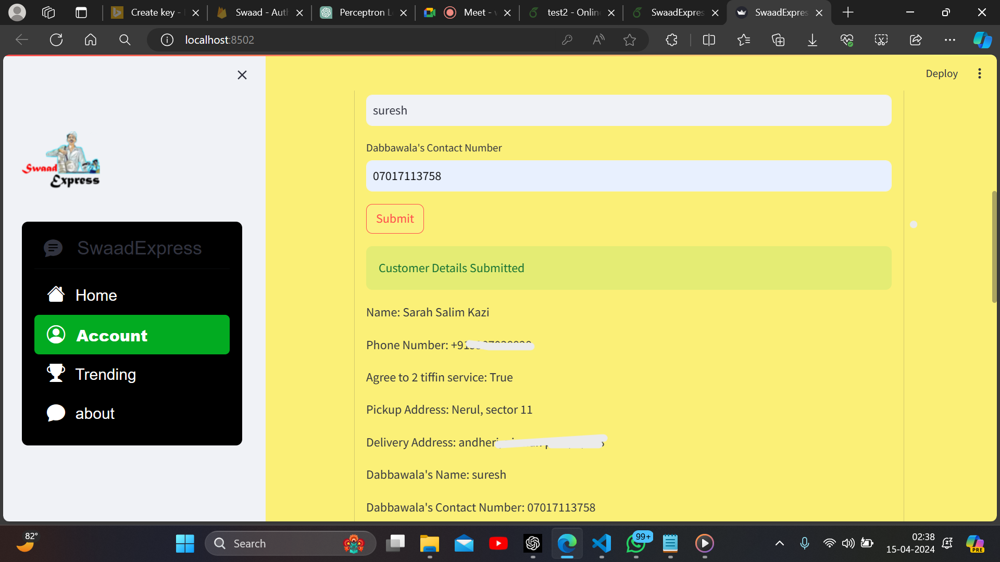
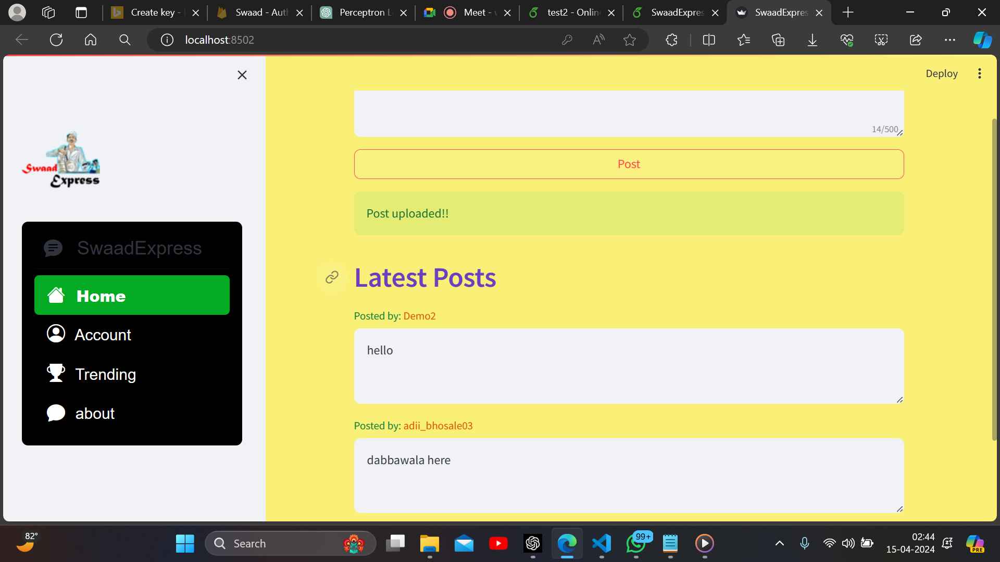
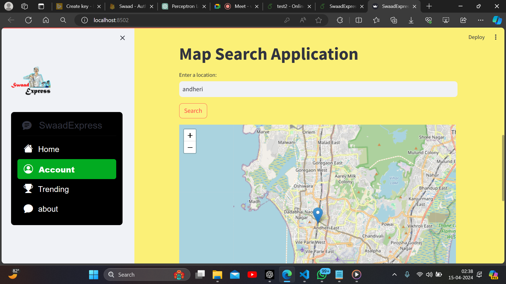
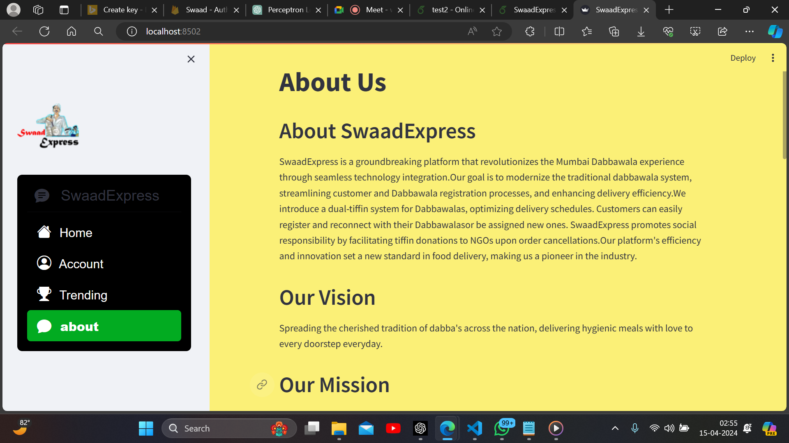
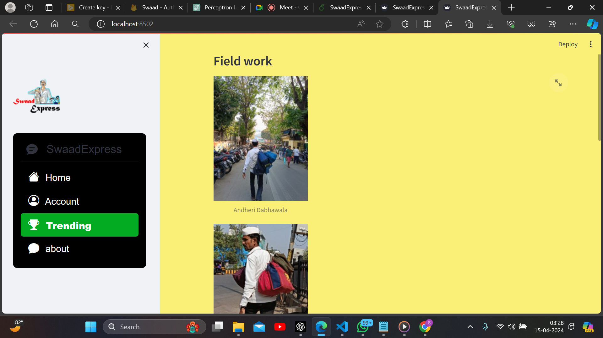
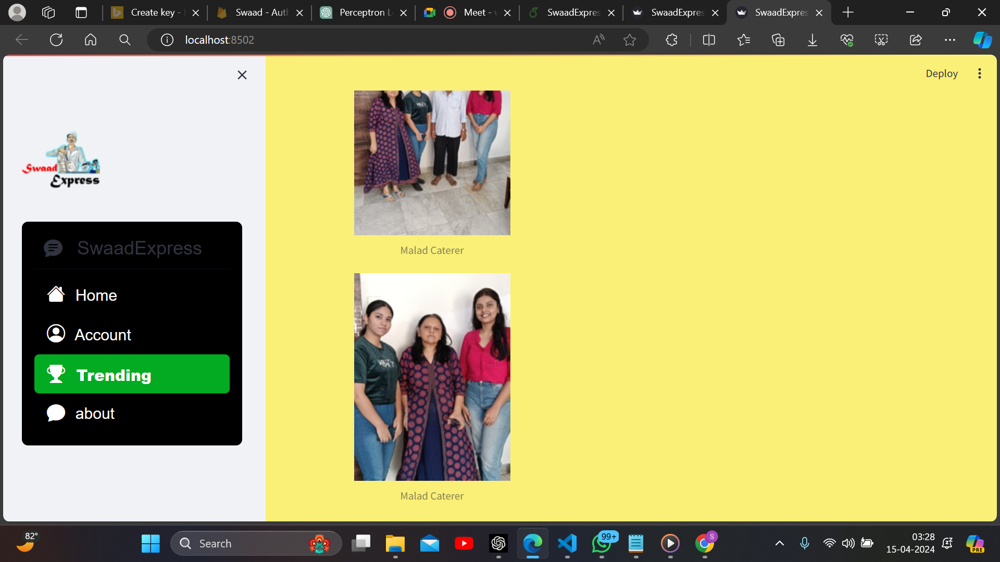

<<<<<<< HEAD
# 🍱 SwaadExpress - Desi Dill Se

A smart food delivery platform inspired by the iconic **Mumbai Dabbawala** network. SwaadExpress connects customers, dabbawalas, and food providers through a streamlined web application, making homemade meal delivery more organized, efficient, and accessible.

---

## 📖 Overview

SwaadExpress was developed as a college project to modernize the traditional Mumbai Dabbawala system using technology.

The platform allows customers to register, order homemade meals, and get assigned a dabbawala for delivery. It also provides separate registration and login portals for customers and dabbawalas, creating a structured delivery workflow.

---

## 🎯 Problem Statement

Many working professionals and students struggle to find affordable, hygienic homemade meals. While Mumbai's Dabbawala network is one of the most efficient delivery systems in the world, much of its operation is still manual.

SwaadExpress aims to digitize this process by providing an easy-to-use platform for ordering, managing, and delivering tiffin services.

---

## ✨ Features

* 👤 Customer Registration & Login
* 🚴 Dabbawala Registration & Login
* 🍛 Avail Tiffin Service
* 📍 Dabbawala Allocation
* 📝 Customer Registration Validation
* 📢 Posts & Updates Section
* ℹ️ About Us Page
* 📱 Responsive User Interface
* 🔒 Secure Authentication using Firebase
* 🎨 Clean Streamlit-based Interface

---

## 🛠 Tech Stack

| Technology | Purpose                   |
| ---------- | ------------------------- |
| Python     | Backend                   |
| Streamlit  | Web Application           |
| Firebase   | Authentication & Database |
| HTML       | Structure                 |
| CSS        | Styling                   |
| JavaScript | Client-side Functionality |
| Git        | Version Control           |
| GitHub     | Repository Hosting        |

---

## ⚙️ Project Workflow

Customer Registration/Login

⬇️

Choose Tiffin Service

⬇️

Order Processing

⬇️

Dabbawala Assignment

⬇️

Delivery Management

---

## 📷 Screenshots

### 🏠 Account Login Page



---

### 👤 Customer Registration



---

### 🚴 Dabbawala Registration



---

### 🚴 Dabbawala Allocated to Customer



---

### 📰 Posts Section



---

### 🍱 Map Search



---

### ℹ️ About Us



---

### 📍 Field Work




---

## 📂 Project Structure

```
SwaadExpress
│
├── assets
├── screenshots
├── app.py
├── requirements.txt
├── README.md
└── ...
```

---

## 🚀 Future Enhancements

* 📍 Live GPS Tracking
* 💳 Online Payment Integration
* 📱 Android Application
* 🔔 Push Notifications
* 🤖 AI-based Route Optimization
* ⭐ Ratings & Reviews
* 🏢 Vendor Dashboard
* 🥗 Nutrition Recommendations

---

## 👥 Contributors

* **Sarah Kazi**
* **Aditi Bhosale**

---

## 🙏 Acknowledgements

This project was developed as part of our academic journey to explore real-world problem solving through software development. Inspired by the remarkable efficiency of the Mumbai Dabbawala system, SwaadExpress demonstrates how technology can enhance traditional delivery networks while preserving their core values.

---

⭐ If you found this project interesting, consider giving the repository a star.
=======
# SwaadExpress: Desi Dill Se 🍱

A food delivery platform inspired by Mumbai's famous Dabbawalla network.

## Features

- Customer Login & Registration
- Dabbawalla Dashboard
- Order Management
- Route Optimization
- NGO Food Donation Support
- Live Delivery Tracking
- Customer Reviews
- Real-Time Notifications

## Tech Stack

- Python
- Streamlit
- Firebase
- OpenRailway API
- Bing Maps API

## Problem Solved

Food wastage and inefficient last-mile food delivery.

## Future Enhancements

- AI-based route optimization
- Mobile application
- Vendor onboarding
- Digital payment integration

## Author

Sarah Kazi
>>>>>>> 682272598131c7dcd26980ac3f5f0075ba9b49fd
